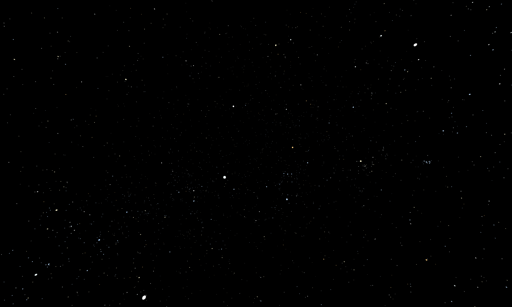

# glTF Starfield

*"My god, it's full of stars ..."*

A [Deno](https://deno.land) program to translate the
[Yale Bright Star Catalog](http://tdc-www.harvard.edu/catalogs/bsc5.html)
to [glTF](https://en.wikipedia.org/wiki/GlTF).



This 3D model of the starfield visible from Earth typically would be used to render a background layer
over which other layers can be composited.
All stars are on the surface of the unit sphere and face its center. To give the illusion of the
stars being infinitely far away, their rendering camera should naturally be always located at the center
of the unit sphere (never translate the camera, only rotate it).


## Usage

```sh
deno run --allow-net --allow-read --allow-write --allow-run main.ts # produces starfield.glb (~ 2MB)
```

## Dependencies

* [Deno](https://deno.land) (version see [.tool-versions](.tool-versions))
* `gunzip` executable in `PATH`

## Details

- The database http://tdc-www.harvard.edu/catalogs/bsc5.dat.gz is downloaded, decompressed,
    and its ~9k entries are parsed.
- 10 Materials are created from the spectral classification of stars (`OWBAFGKMCS`).
    The colors of the materials were taken from the HTML code of
    https://en.wikipedia.org/wiki/Stellar_classification#Harvard_spectral_classification
    and are set as base factors as well as emissive factors.
  * The `extras` field contains:
    - `cls`: Spectral class (a letter from the set `OWBAFGKMCS`)
- Each star in the catalog becomes one `node`.
  * A single octagon (in triangle strip mode) is referenced by all mesh primitives.
  * The scale is calculated from the star's apparent magnitude.
  * The translation puts it on the surface of the unit sphere according to the star's right ascension
      and declination.
  * The rotation makes it face the unit sphere center.
  * The material is selected according to the star's spectral classification.
  * The `extras` field contains:
    - `mag`: Apparent magnitude
    - `bsn`: The numeric BSN ID
    - `name`: A name concatenated from the two name fields in the DB
